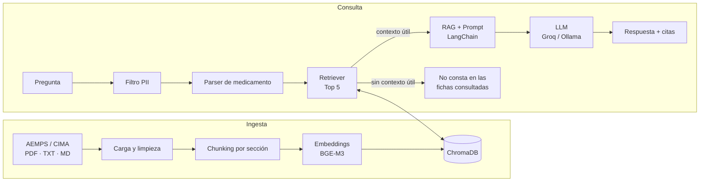

<p align="center">
  
</p>

<p align="center">
  <strong>Fichas técnicas con la fuente a la vista</strong>
</p>

<p align="center">
  Asistente RAG para consultar fichas técnicas oficiales de medicamentos de AEMPS/CIMA mediante lenguaje natural, con respuestas fundamentadas, trazables y verificables.
</p>

<p align="center">
  
  
  
  
  
  
</p>

---

## FichaClara

**FichaClara** es un sistema de Generación Aumentada por Recuperación (**RAG**) que permite hacer preguntas en lenguaje natural sobre fichas técnicas oficiales de medicamentos.

El sistema no responde a partir del conocimiento general del modelo. Primero recupera los fragmentos más relevantes de la documentación disponible y después utiliza únicamente ese contexto para construir la respuesta.

Cada respuesta conserva la trazabilidad hasta la fuente original mediante datos como:

- medicamento;
- sección de la ficha técnica;
- página;
- fragmento utilizado;
- enlace a CIMA.

> **Aviso sanitario**
>
> FichaClara es un buscador sobre documentación oficial. No es un sistema de apoyo a la decisión clínica y no sustituye al farmacéutico ni al médico. La información debe verificarse siempre en la fuente citada.

---

## El problema

Las fichas técnicas contienen información fiable y detallada, pero localizar manualmente un dato concreto puede requerir revisar documentos de decenas de páginas.

FichaClara busca reducir ese tiempo manteniendo tres principios:

1. **Grounding** — responder a partir de documentación recuperada, no de conocimiento libre del LLM.
2. **Trazabilidad** — mostrar de dónde procede la información.
3. **No alucinación controlada** — si no existe contexto suficiente, indicar que la información no consta en las fichas consultadas.

El proyecto se centra en documentación farmacológica oficial de **AEMPS/CIMA** y no pretende realizar diagnóstico, prescripción ni recomendaciones clínicas individualizadas.

---

## Estado del proyecto

| Elemento | Estado |
|---|---|
| Catálogo actual | **241 fichas técnicas** |
| Corpus procesado | **18.143 fragmentos** |
| Embeddings | **BAAI/bge-m3** |
| Base vectorial | **ChromaDB persistente** |
| Recuperación | **Top 5** |
| Orquestación | **LangChain** |
| API | **FastAPI** |
| Frontend | **HTML + CSS + JavaScript** |
| LLM | **Groq u Ollama** |
| Privacidad | **Filtro PII previo al LLM** |
| Calidad | **pytest + Ruff + GitHub Actions** |
| Tests actuales | **211 passing** |

---

## Arquitectura

FichaClara separa el sistema en dos flujos: **ingesta** y **consulta**.



El flujo completo es:

**documento → limpieza → chunking → embeddings → ChromaDB → pregunta → recuperación → contexto → LLM → respuesta con fuentes**

Más detalle en [`docs/arquitectura.md`](docs/arquitectura.md).

---

## Ingesta y chunking

Las fichas técnicas de AEMPS siguen una estructura numerada estable: indicaciones, posología, contraindicaciones, interacciones, farmacocinética, etc.

Por ese motivo no se utiliza un troceo fijo como estrategia principal.

### Estrategia elegida

Cada **sección oficial** se mantiene como unidad semántica.

Cuando una sección supera aproximadamente **1.500 caracteres**, se subdivide en fragmentos de aproximadamente **1.000 caracteres con un 15 % de solape**, siempre sin mezclar secciones diferentes.

Cada fragmento conserva metadatos como:

- número de registro;
- medicamento;
- sección;
- página;
- identificador estable;
- fecha de revisión;
- URL de la fuente.

En la validación realizada durante el experimento de chunking, la estrategia por sección consiguió **100 % de cobertura y 99,8 % de precisión** sobre la segmentación oficial evaluada, evitando además la mezcla de secciones observada con estrategias de tamaño fijo.

La justificación y los experimentos completos están en [`docs/chunking.md`](docs/chunking.md).

---

## Embeddings y recuperación

El objetivo del retriever es reducir más de **18.000 fragmentos** a los **5 candidatos más relevantes** para cada pregunta.

Se compararon cuatro estrategias sobre el mismo golden set:

| Estrategia | Hit@1 | Hit@3 | Hit@5 | MRR |
|---|---:|---:|---:|---:|
| BM25 | 36,7 % | 50,0 % | 60,0 % | 0,4456 |
| multilingual-E5-base | 60,0 % | 76,7 % | 80,0 % | 0,6844 |
| BGE-M3 + BM25 | 56,7 % | 70,0 % | 80,0 % | 0,6528 |
| **BGE-M3** | **60,0 %** | **80,0 %** | **86,7 %** | **0,7111** |

**BGE-M3** fue seleccionado porque obtuvo el mejor rendimiento global tanto en Hit@5 como en MRR.

Además, con BGE-M3 la **ficha correcta apareció dentro del Top 5 en el 100 % de las preguntas respondibles evaluadas**.

Esto indica que los principales errores restantes se encuentran en el ranking de algunas secciones dentro de la ficha, no en la identificación del medicamento.

> Estas métricas deben considerarse preliminares hasta completar la verificación manual del golden set contra los PDF originales.

### Detección del medicamento

El parser identifica medicamentos a partir del catálogo antes de realizar la recuperación:

- **un medicamento conocido** → búsqueda filtrada por su número de registro;
- **varios medicamentos conocidos** → búsqueda global, necesaria por ejemplo para preguntas sobre interacciones;
- **ningún medicamento conocido** → el retriever puede rechazar la consulta sin realizar una búsqueda vectorial innecesaria.

---

## Por qué BGE-M3

Los embeddings transforman textos en vectores que representan su significado.

Esto permite relacionar consultas y documentos aunque no utilicen exactamente las mismas palabras. Por ejemplo, una pregunta como:

> ¿Cuánto tarda este medicamento en eliminarse?

puede relacionarse con una sección que utilice el término **semivida**.

Se evaluó `intfloat/multilingual-e5-base` como alternativa, además de BM25 y una combinación híbrida vectorial + léxica.

La búsqueda híbrida añadió complejidad sin mejorar el resultado de BGE-M3, por lo que se mantuvo la solución más simple que ofrecía mejor rendimiento.

La decisión completa está documentada en [`docs/decisiones_tecnicas.md`](docs/decisiones_tecnicas.md).

---

## Por qué ChromaDB

Las representaciones vectoriales se almacenan en **ChromaDB**.

Se eligió porque cubre los requisitos del proyecto sin necesidad de infraestructura externa:

- persistencia local;
- integración directa con LangChain;
- almacenamiento de metadatos;
- filtrado por número de registro;
- actualización mediante identificadores de chunk estables;
- borrado por documento;
- índices separados para distintos modelos de embeddings.

La elección se basa en su adecuación al proyecto. No se realizó un benchmark entre distintos motores vectoriales.

---

## Decisión sobre el umbral de similitud

También se evaluó la posibilidad de establecer una puntuación mínima global para rechazar resultados poco relevantes.

Los experimentos mostraron solapamiento entre ambos grupos:

- una consulta que debía rechazarse llegó aproximadamente a **0,7081**;
- una consulta válida llegó aproximadamente a **0,5788**.

Por tanto, un único corte produciría necesariamente falsos rechazos o aceptaría consultas que deberían descartarse.

La configuración final mantiene:

```text
RELEVANCE_THRESHOLD=None
```

En lugar de depender de un único número global, el sistema combina la detección mediante catálogo, el medicamento identificado, la recuperación Top 5 y las reglas posteriores del flujo RAG.

Con este guard basado en catálogo se obtuvo, en la evaluación realizada:

- **rechazo correcto: 100 %**;
- **falsos rechazos: 0 %**.

---

## RAG y grounding

Una vez recuperados los fragmentos relevantes comienza la etapa de generación.

El modelo de lenguaje **no recibe las 241 fichas completas**. Recibe únicamente el contexto recuperado para la pregunta.

El prompt del sistema:

- restringe la respuesta al contexto proporcionado;
- exige citas asociadas a los fragmentos recuperados;
- evita presentar información no sustentada como si procediera de las fichas;
- mantiene las limitaciones de uso sanitario.

Cada cita `[n]` se valida contra las fuentes realmente recuperadas.

Si no existe contexto útil, el sistema devuelve una respuesta controlada indicando que la información **no consta en las fichas consultadas**, sin dar al modelo la oportunidad de completar la respuesta mediante conocimiento externo.

---

## Trazabilidad

Los metadatos viajan desde la ingesta hasta la interfaz.

Una fuente puede mostrar:

```text
Medicamento
└── Sección
    └── Página
        └── Fragmento utilizado
            └── Fuente oficial CIMA
```

Esto permite que una persona pueda comprobar manualmente la evidencia utilizada para construir la respuesta.

---

## Privacidad y seguridad

Los embeddings se calculan **localmente**.

Para la generación se puede seleccionar el proveedor mediante configuración:

```env
LLM_PROVIDER=groq
```

o:

```env
LLM_PROVIDER=ollama
```

### Filtro de datos personales

Antes de enviar una pregunta al LLM, FichaClara aplica un filtro PII capaz de detectar y enmascarar distintos identificadores y datos personales.

Cuando se detecta información sensible:

```text
dato personal → [DATO] → LLM
```

La interfaz avisa además de que se ha aplicado el filtro.

El filtro es una medida preventiva basada en reglas; **no es un anonimizador certificado**.

Para un posible despliegue con información sensible, el diseño contempla el uso de **Ollama en local**, evitando que el contenido salga del entorno controlado.

Más información en [`docs/etica_y_privacidad.md`](docs/etica_y_privacidad.md).

---

## Interfaz web

La interfaz final está implementada con **HTML, CSS y JavaScript**, sin proceso de compilación.

Incluye:

- chat conectado a la API real;
- citas `[n]` interactivas;
- tarjetas de fuentes;
- medicamento, sección, página y enlace original;
- estado diferenciado cuando no existe respuesta;
- aviso de datos personales;
- aviso sanitario permanente;
- subida de PDF, TXT y MD;
- listado y eliminación de documentos;
- diseño responsive;
- modo demo sin backend.

La identidad visual utiliza la misma paleta que el logotipo de FichaClara:

| Uso | Color |
|---|---|
| Menta | `#E6F5F2` |
| Teal | `#23938A` |
| Teal oscuro | `#0F5C59` |
| Texto | `#173A3D` |
| Coral | `#F4906F` |

La documentación específica está en [`frontend/web/README.md`](frontend/web/README.md).

---

## API

La aplicación expone una API **FastAPI**.

| Método | Endpoint | Función |
|---|---|---|
| `GET` | `/health` | Estado del servicio |
| `POST` | `/query` | Ejecuta una consulta RAG |
| `POST` | `/ingest` | Procesa e indexa PDF, TXT o MD |
| `GET` | `/documents` | Lista documentos indexados |
| `DELETE` | `/documents/{document_id}` | Elimina un documento del índice |

FastAPI proporciona además documentación interactiva en:

```text
http://localhost:8000/docs
```

---

## Instalación

### Requisitos

- Python **3.11**
- Git
- conexión a Internet para descargar dependencias y modelos la primera vez;
- Groq API o una instalación local de Ollama para la generación.

Clona el repositorio y crea el entorno:

```bash
git clone https://github.com/adrianaarang/FichaClara.git
cd FichaClara

python -m venv .venv
source .venv/bin/activate
pip install -r requirements.txt
```

En Windows PowerShell:

```powershell
python -m venv .venv
.venv\Scripts\Activate.ps1
pip install -r requirements.txt
```

Crea la configuración local:

```bash
cp .env.example .env
```

Las claves y configuraciones privadas deben permanecer en `.env` y **no deben subirse al repositorio**.

---

## Preparar la base documental

Desde la raíz del repositorio:

### 1. Descargar fichas desde CIMA

```bash
python -m scripts.download_fichas
```

### 2. Limpiar y generar los chunks

```bash
python -m src.ingestion.pipeline
```

El resultado se guarda en:

```text
data/processed/chunks.jsonl
```

### 3. Construir el índice vectorial

```bash
python -m scripts.build_index
```

Por defecto se utiliza:

```text
Modelo:     BAAI/bge-m3
Colección: fichas_tecnicas
Directorio: data/chroma
Top K:      5
```

---

## Ejecutar FichaClara

### 1. API

Desde la raíz:

```bash
uvicorn src.api.main:app --port 8000
```

La API estará disponible en:

```text
http://localhost:8000
```

### 2. Frontend

En otra terminal:

```bash
python -m http.server 5173 --directory frontend/web
```

Abre:

```text
http://localhost:5173
```

### Modo demo

La interfaz también puede ejecutarse sin API:

```text
http://localhost:5173/?mock=1
```

Este modo utiliza respuestas simuladas compatibles con el contrato real de la aplicación.

---

## Evaluación

El proyecto incluye un **golden set de 40 preguntas**:

- 30 preguntas con respuesta esperada;
- 10 preguntas sin respuesta o fuera de alcance.

Se evalúan por separado:

### Retrieval

```bash
python -m evaluation.eval_retrieval --retriever bm25
python -m evaluation.eval_retrieval --retriever real --etiqueta bge-m3
```

Entre las métricas utilizadas están:

- Hit@1;
- Hit@3;
- Hit@5;
- MRR;
- acierto de ficha;
- rechazo correcto;
- falsos rechazos.

### Generación

Con la API en ejecución:

```bash
python -m evaluation.eval_generation --api-url http://localhost:8000
```

Se comprueban aspectos como:

- rechazo correcto;
- citas válidas;
- cita correcta;
- PII;
- ausencia de fugas;
- fidelidad mediante revisión humana.

Metodología completa en [`docs/evaluacion.md`](docs/evaluacion.md).

---

## Calidad

El proyecto utiliza:

```bash
ruff check .
pytest -q
```

La integración continua mediante **GitHub Actions** ejecuta Ruff y pytest automáticamente en pull requests y pushes a las ramas de integración y entrega.

Estado validado antes del cierre:

```text
211 tests passed
ruff check . → limpio
```

---

## Estructura principal

```text
FichaClara/
├── data/
│   ├── catalogo_medicamentos.csv
│   ├── processed/
│   ├── raw/
│   └── chroma/
├── docs/
│   ├── arquitectura.md
│   ├── chunking.md
│   ├── decisiones_tecnicas.md
│   ├── etica_y_privacidad.md
│   └── evaluacion.md
├── evaluation/
├── frontend/
│   └── web/
├── scripts/
├── src/
│   ├── api/
│   ├── common/
│   ├── generation/
│   ├── guardrails/
│   ├── indexing/
│   ├── ingestion/
│   └── retrieval/
└── tests/
```

---

## Documentación técnica

| Documento | Contenido |
|---|---|
| [`docs/arquitectura.md`](docs/arquitectura.md) | Arquitectura y contratos entre módulos |
| [`docs/chunking.md`](docs/chunking.md) | Estrategia y experimentos de fragmentación |
| [`docs/decisiones_tecnicas.md`](docs/decisiones_tecnicas.md) | ADR y decisiones de arquitectura |
| [`docs/evaluacion.md`](docs/evaluacion.md) | Golden set, métricas y evaluación |
| [`docs/etica_y_privacidad.md`](docs/etica_y_privacidad.md) | Privacidad, PII, ética y riesgos |
| [`frontend/web/README.md`](frontend/web/README.md) | Interfaz web |

---

## Equipo

| Rol | Persona | Responsabilidad principal |
|---|---|---|
| P1 | Adriana | Ingesta y chunking |
| P2 | David | Embeddings, ChromaDB y retrieval |
| P3 | Josema | RAG, LLM y API |
| P4 | Anas | Frontend |
| P5 | Yohanna | Evaluación, privacidad, calidad y documentación |

El desarrollo se ha realizado mediante ramas de trabajo, pull requests, revisión cruzada y CI.

---

## Flujo Git

```text
feature/* / fix/* / docs/*
          │
          ▼
       develop
          │
          ▼
        main
```

- `develop` actúa como rama de integración.
- `main` representa la versión entregable.
- Los cambios se integran mediante pull requests.
- GitHub Actions ejecuta las comprobaciones automáticas de calidad.
- Los commits siguen una convención descriptiva por ámbito.

---

## Limitaciones conocidas

FichaClara tiene limitaciones que deben tenerse en cuenta:

- el sistema solo conoce los documentos indexados;
- las fichas técnicas pueden cambiar con el tiempo;
- algunas tablas extraídas de PDF pueden perder parte de su estructura visual;
- el ranking puede recuperar la ficha correcta pero no situar siempre la sección esperada entre los primeros resultados;
- el filtro PII reduce el riesgo, pero no sustituye un proceso formal de anonimización;
- el golden set actual es limitado y requiere validación humana;
- las respuestas deben verificarse siempre en la fuente citada.

---

<p align="center">
  
</p>

<p align="center">
  <strong>FichaClara</strong><br>
  Información oficial, contexto recuperado y fuente verificable.
</p>
