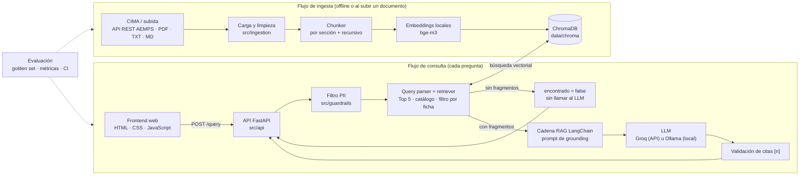

# Arquitectura

> Responsable: P5 · Calidad, evaluación, DevOps y documentación

FichaClara son dos flujos independientes que comparten la base vectorial (ChromaDB): uno
de **ingesta**, que convierte fichas técnicas y documentos subidos en fragmentos
indexados, y uno de **consulta**, que responde cada pregunta con esos fragmentos.

## Diagrama

## Flujo de ingesta

1. **Carga** (`src/ingestion/cima_client.py`, `loaders.py`): descarga de las fichas del
   catálogo desde CIMA a `data/raw/` y lectura de PDF (PyMuPDF, conservando el nº de
   página), TXT y MD. Un PDF vacío o escaneado da un error controlado.
2. **Limpieza** (`cleaner.py`): elimina cabeceras y pies repetidos, «Página X de Y» y
   palabras partidas por guion.
3. **Chunking** (`chunker.py`): una sección numerada (4.2, 4.5…) es un fragmento; las de
   más de ~1.500 caracteres se subdividen (~1.000, 15 % de solape) sin salir de la
   sección. Cada fragmento empieza por una cabecera `[Medicamento · 4.5 Interacciones]`.
   Los documentos sin plantilla usan un troceo recursivo genérico. Salida:
   `data/processed/chunks.jsonl`. Justificación en [`chunking.md`](chunking.md).
4. **Indexado** (`src/indexing`, `scripts/build_index.py`): embeddings locales y ChromaDB
   persistente con upsert por `chunk_id` (reindexar no duplica).

## Flujo de consulta

1. El frontend envía la pregunta a `POST /query`.
2. `check_pii` (P5) sustituye los datos personales por `[DATO]`. Si detecta alguno, la
   respuesta llevará `aviso_pii = true` y al LLM solo llega el texto enmascarado.
3. El query parser detecta medicamentos conocidos en el catálogo. Si encuentra uno,
   filtra la búsqueda por su `nregistro`; si encuentra varios, mantiene una búsqueda
   global para permitir consultas de interacción; si no encuentra ninguno, devuelve
   una lista vacía sin consultar Chroma.
4. El retriever recupera los **5 fragmentos más relevantes**. No se aplica un umbral
   global de similitud porque la evaluación mostró solapamiento entre las puntuaciones
   de preguntas respondibles y las que debían rechazarse.
5. Si no hay ninguno, la API responde `encontrado = false` con un mensaje fijo, sin llamar
   al LLM.
6. Si los hay, la cadena LangChain construye el prompt de grounding con los fragmentos
   numerados y llama al LLM configurado en `LLM_PROVIDER`.
7. Se valida que cada cita `[n]` corresponda a un fragmento recuperado.
8. La API devuelve respuesta y fuentes; el frontend las muestra con medicamento, sección,
   página, fragmento y enlace a CIMA.

## Contratos entre módulos

Definidos en `src/common/schemas.py`. Solo cambian con una PR aprobada por dos personas.

| Contrato | Lo produce | Lo consume | Forma |
|---|---|---|---|
| `Chunk` + `ChunkMetadata` | P1 · Adriana | P2, P5 | `data/processed/chunks.jsonl`, una línea por chunk |
| `retrieve(question, k) → list[RetrievedChunk]` | P2 · David | P3, P5 | Función Python |
| `ingest_file(path) → list[Chunk]` | P1 · Adriana | P3 (`/ingest`) | Función Python |
| `add_chunks`, `delete_document`, `list_documents` | P2 · David | P3 | Funciones Python |
| `check_pii(texto) → PiiResult` | P5 · Yohanna | P3 | Función Python |
| `QueryRequest` / `QueryResponse` (`respuesta`, `fuentes`, `encontrado`, `aviso_pii`) | P3 · Josema | P4, P5 | JSON de `POST /query` |
| `IngestResponse`, `DocumentoIndexado` | P3 · Josema | P4 | JSON de `/ingest` y `GET /documents` |

## Decisiones técnicas

Cada decisión se documenta como ADR en [`decisiones_tecnicas.md`](decisiones_tecnicas.md).

| Ámbito | Decisión | Responsable |
|---|---|---|
| Chunking | Por sección numerada + subtroceo con solape | P1 |
| Embeddings | `BAAI/bge-m3` local (alternativa: `multilingual-e5-base`) | P2 |
| Base vectorial | ChromaDB persistente, distancia coseno | P2 |
| Orquestación | LangChain (LCEL) | P3 |
| LLM | Groq u Ollama, intercambiables por `.env` | P3 |
| Frontend | HTML + CSS + JavaScript | P4 |
| Calidad | pytest + ruff en CI, golden set, filtro PII | P5 |
